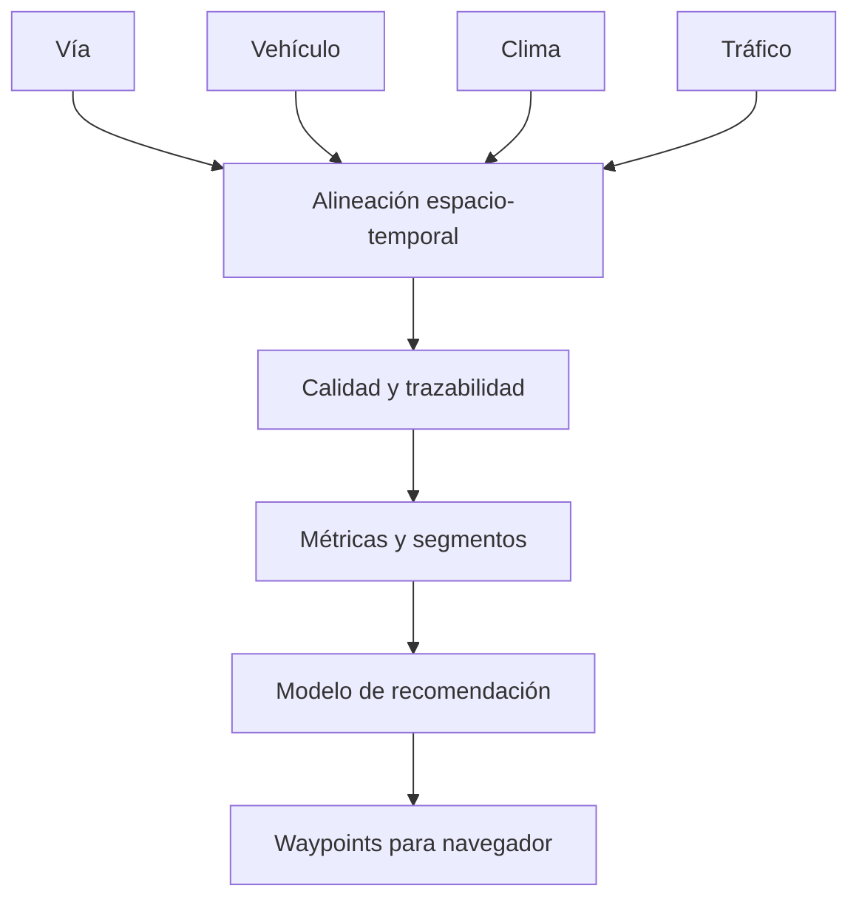

# Análisis de Telemetría

Plataforma privada y reproducible para convertir telemetría vehicular y contexto de ruta en análisis de eficiencia y waypoints de conducción explicables.

## Objetivo

El flujo recibe cuatro familias de entrada:

1. **Vía:** geometría, PK, elevación, rasante y límites.
2. **Vehículo:** telemetría, configuración mecánica, transmisión y PIDs.
3. **Clima:** viento, temperatura, precipitación y presión.
4. **Tráfico:** velocidades observadas, incidencias y nivel de servicio.

Las normaliza sobre tiempo y distancia, aplica reglas de calidad, distingue hechos medidos de valores derivados y genera recomendaciones georreferenciadas. En vehículos automáticos recomienda principalmente velocidad y anticipación; solo propone marcha cuando la configuración declara transmisión manual o control manual autorizado.

## Estado

Versión `0.1.0`: estructura inicial, contrato Car Scanner largo, reglas de calidad básicas, integración de combustible y energía HV, pendiente con ventana configurable, recomendador provisional y superficie web de carga local.

No existe todavía un modelo validado capaz de afirmar una “configuración perfecta”. Las recomendaciones permanecen provisionales hasta acumular pasadas comparables y pruebas suficientes.

## Inicio local

Requisitos: Node.js 24 y pnpm 10.

```bash
pnpm install --frozen-lockfile
pnpm dev
```

Validación completa:

```bash
pnpm verify
```

## Arquitectura



La descripción completa está en [docs/architecture/overview.md](docs/architecture/overview.md).

## Privacidad

La aplicación procesa archivos en el navegador. El repositorio acepta exclusivamente fixtures sintéticos. `.gitignore` bloquea patrones de telemetría, GPS, secretos y exportaciones reales. Consulta [SECURITY.md](SECURITY.md).

## Gobierno

- SemVer y releases etiquetadas.
- Ramas `feature/*`, `fix/*`, `docs/*` y `chore/*`.
- PR obligatoria para cambios funcionales.
- ADR en `docs/decisions/`.
- Evolución en `CHANGELOG.md` y `docs/progress-log.md`.
- Snapshot en `legacy/` únicamente al publicar un hito.

## Estructura

```text
app/                    aplicación web
components/             superficies y controles
lib/domain/             modelo canónico
lib/telemetry/          ingesta, calidad y métricas
lib/route/              geometría, elevación y pendientes
lib/optimizer/          recomendaciones y waypoints
docs/architecture/      arquitectura y flujos
docs/contracts/         contratos de entrada y salida
docs/decisions/         decisiones de arquitectura
docs/domain/            fundamentos y fórmulas
docs/runbooks/          operación reproducible
tests/fixtures/         datos exclusivamente sintéticos
legacy/                 snapshots de releases publicados
```
